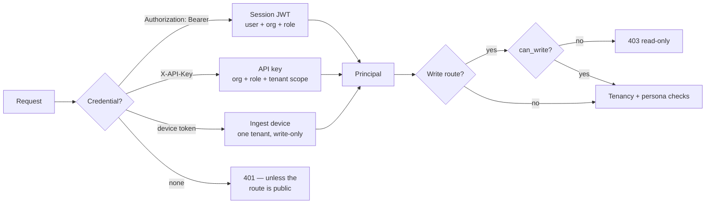

# NextXR Digital Twin — API Specification

**188 routes across 18 groups, extracted from the running FastAPI application on
2026-09-07.** The machine-readable companion is
[`SetupDocs/nextxr_openapi.json`](SetupDocs/nextxr_openapi.json) (OpenAPI 3.1.0,
177 documented paths, 57 component schemas), exported from the same app object
that serves traffic — so it cannot drift from the implementation the way a
hand-written spec does.

Interactive docs are served by the app itself at **`/docs`** (Swagger UI) and
**`/redoc`** when it is running.

---

## 1. Conventions

| | |
|---|---|
| Base path | `/api/v1` |
| Transport | HTTPS in production (ALB terminates TLS); plain HTTP locally |
| Content type | `application/json` on request and response, except SSE streams and file uploads |
| Timestamps | ISO-8601 UTC strings, e.g. `2026-09-07T05:22:52.065511+00:00` |
| Identifiers | opaque prefixed strings — `usr_`, `org_`, `ses_`, `task_`, `run_` |
| Tenancy | `tenant_id` names one twin; every read is scoped to the caller's organisation |

### Error shape

All errors return a FastAPI problem body:

```json
{ "detail": "Authentication required. Send an 'Authorization: Bearer <token>' header (sign in at /api/v1/auth/login) or an 'X-API-Key' header." }
```

| Status | Meaning in this API |
|---|---|
| `400` | malformed input, or an invalid enum (`scope` must be `team` or `all`) |
| `401` | no credential, or a supplied credential that is invalid/expired |
| `403` | authenticated but not permitted — wrong persona, wrong team, or a read-only credential on a write route |
| `404` | not found **or** not yours — a task belonging to another org reports 404, never 403, so the endpoint does not confirm the id exists |
| `409` | illegal state transition (e.g. completing a task twice) |
| `422` | request body failed schema validation |
| `429` | rate limited |

The 404-not-403 rule is deliberate and load-bearing: a 403 on a foreign resource
would confirm its existence to an attacker enumerating ids.

---

## 2. Authentication and authorisation

Three credential types, resolved by `server/auth.py`:



### The two authorisation axes

Authorisation is **not** a single ladder. Two independent columns on
`memberships` govern different questions:

| axis | values | governs | enforced in |
|---|---|---|---|
| `role` | `owner` / `admin` / `write` / `read` | which data you may touch | `server/tenancy.py` |
| `persona` | `supervisor` / `frontline` | which job you do | `work/authority.py` |

`GET /api/v1/work/me` returns the caller's persona **and its capability list**,
and the frontend renders its buttons from exactly that list — so a button that is
drawn is a button the API will honour.

> **Posture.** Authentication is **required by default**. `server/auth.py` used
> to serve any request without a credential whenever `NXR_API_KEYS` was unset,
> which meant a deployment that forgot an environment variable was open. That
> default is inverted; `NXR_DEV_MODE=1` is the explicit local opt-out and lives
> in `start.ps1`, not in the code.

### Public routes

`GET /api/v1/health`, `/health/live`, `/health/ready`, `/api/v1/auth/posture`,
and the auth entry points (`login`, `signup`, `refresh`, `password/forgot`,
`password/reset`, `verify-email`).

---

## 3. Route groups

### 3.1 `auth` — accounts, sessions, org administration (24)

| Method | Path |
|---|---|
| `POST` | `/api/v1/auth/signup` |
| `POST` | `/api/v1/auth/login` |
| `POST` | `/api/v1/auth/refresh` |
| `POST` | `/api/v1/auth/logout` |
| `GET` | `/api/v1/auth/me` |
| `GET` | `/api/v1/auth/posture` |
| `POST` | `/api/v1/auth/switch-org` |
| `POST` | `/api/v1/auth/verify-email` |
| `POST` | `/api/v1/auth/password/change` · `forgot` · `reset` |
| `GET` | `/api/v1/auth/sessions` |
| `DELETE` | `/api/v1/auth/sessions/{session_id}` |
| `POST` | `/api/v1/auth/sessions/revoke-others` |
| `GET` `POST` | `/api/v1/auth/orgs/{org_id}/members` |
| `PATCH` `DELETE` | `/api/v1/auth/orgs/{org_id}/members/{user_id}` |
| `PATCH` | `/api/v1/auth/orgs/{org_id}/members/{user_id}/persona` |
| `GET` `POST` | `/api/v1/auth/orgs/{org_id}/keys` |
| `DELETE` | `/api/v1/auth/orgs/{org_id}/keys/{key_id}` |
| `GET` | `/api/v1/auth/orgs/{org_id}/tenants` · `/audit` |

Note `members/{user_id}/persona` is its own endpoint rather than a field on the
member PATCH — changing what job someone does is a different decision from
changing what data they may read, and the split keeps them separately auditable.

### 3.2 `work` — the dispatch loop (20)

The supervisor → operator half of the product.

| Method | Path | Who |
|---|---|---|
| `GET` | `/api/v1/work/me` | any — persona + capability list |
| `GET` | `/api/v1/work/queue` · `/board` | supervisor |
| `GET` | `/api/v1/work/roster?scope=team\|all` | supervisor |
| `GET` | `/api/v1/work/team-stats?days=` | supervisor |
| `GET` | `/api/v1/work/teams` | supervisor |
| `POST` | `/api/v1/work/tasks` | supervisor — raise by hand, optionally assign |
| `GET` | `/api/v1/work/tasks/{task_id}` | assignee or supervisor |
| `POST` | `/api/v1/work/tasks/{task_id}/assign` · `/unassign` · `/close` | supervisor |
| `POST` | `/api/v1/work/tasks/{task_id}/start` · `/block` · `/complete` | assignee |
| `POST` | `/api/v1/work/tasks/{task_id}/comment` | either |
| `GET` | `/api/v1/work/tasks/{task_id}/workorder?generate=` | either — `generate=true` bills an LLM call |
| `GET` | `/api/v1/work/inbox` | operator — own work only, no user id parameter |
| `GET` | `/api/v1/work/stats/me?days=` | operator — dashboard aggregate |
| `GET` | `/api/v1/work/history` · `/xp` | operator |

**`roster` scope.** `team` (default) returns who the caller may assign to,
derived from the same `assignable_user_ids` the assign endpoint enforces with —
so the dialog cannot offer somebody the API would refuse. `all` widens the
**view** to every frontline operator in the organisation, each row carrying
`assignable: true|false`. The assign endpoint is unchanged; this lets a
supervisor see who is buried without letting them dispatch outside their teams.

**`inbox` and `stats/me` take no user id.** The server reads the caller from the
session. An operator reads their own work and nobody else's, and there is no
parameter that could be tampered with to change that.

**`complete` does not accept a score.** It takes a `run_id` and reads the score
from the finished `scenario_runs` row, so a page cannot assert its own result.

### 3.3 `scenario` — graded procedures (9)

| Method | Path |
|---|---|
| `GET` | `/api/v1/scenario/procedures` — library + this operator's standing |
| `GET` | `/api/v1/scenario/procedures/{scenario_id}` — steps **without** answers |
| `POST` | `/api/v1/scenario/runs` — start or resume against a task |
| `POST` | `/api/v1/scenario/practice` — start an ungraded practice run |
| `GET` | `/api/v1/scenario/runs` · `/runs/{run_id}` |
| `POST` | `/api/v1/scenario/runs/{run_id}/answer` · `/hint` |
| `GET` | `/api/v1/scenario/runs/{run_id}/result` — debrief, answers revealed |

**The answer key never leaves the server.** `Step.public()` omits `correct`, and
`/result` is the only endpoint that reveals it, after the run is over. A test
asserts no step payload ever carries `correct`. Every run endpoint checks
`run.user_id == caller`: since a completed run produces XP and resolves a task,
that check is the entire authorisation surface of this router.

`procedures` returns per-item standing: `passed`, `required_by`,
`required_task_id`, `attempts`, `last_score`, `best_score`,
`in_progress_run_id`.

### 3.4 `graph` — read the twin (14)

| Method | Path |
|---|---|
| `GET` | `/api/v1/entities` · `/entities/{node_id}` · `/entities/{node_id}/telemetry` |
| `GET` | `/api/v1/findings` |
| `GET` | `/api/v1/topology` · `/stats` |
| `GET` | `/api/v1/changelog` · `/changelog/{entity_id}` |
| `GET` | `/api/v1/bus/stream` — **SSE**, one stream per tenant |
| `GET` | `/api/v1/bus/events` · `/bus/stats` |
| `GET` | `/api/v1/health` · `/health/live` · `/health/ready` |

`/health/live` answers "is the process up"; `/health/ready` answers "can it serve
traffic" and is what the ALB target group should poll.

### 3.5 `write` — mutate the twin (4)

`POST /api/v1/entities`, `PATCH` / `DELETE /api/v1/entities/{node_id}`,
`POST /api/v1/entities/{node_id}/rel`. Every write appends to the hash-chained
change log.

### 3.6 `twins` + `twin-runtime` — registry and live state (13)

| Method | Path |
|---|---|
| `GET` `POST` | `/api/v1/twins` |
| `GET` `DELETE` | `/api/v1/twins/{tenant}` |
| `GET` | `/api/v1/twins/templates` · `/twins/domains` |
| `GET` | `/api/v1/twins/{tenant}/state` · `/network` · `/diagnostics` · `/predict` |
| `POST` | `/api/v1/twins/{tenant}/simulate` · `/project` · `/running` |

### 3.7 `historian` — telemetry history (5)

`GET /api/v1/entities/{node_id}/history` · `/latest`,
`GET /api/v1/twins/{tenant}/signals` · `/trends` · `/history/stats`.

### 3.8 `ingest` — telemetry in (8)

| Method | Path |
|---|---|
| `POST` | `/api/v1/ingest/telemetry` · `/telemetry/bulk` |
| `GET` `POST` | `/api/v1/ingest/devices` |
| `DELETE` | `/api/v1/ingest/devices/{device_id}` |
| `POST` | `/api/v1/ingest/devices/{device_id}/enabled` · `/rotate` |
| `GET` | `/api/v1/ingest/status` |

Devices authenticate with their own token (`token_hash` in `ingest_devices`),
are scoped to one tenant and one `asset_prefix`, and can be rotated or disabled
without touching user accounts. `measurements` has a composite primary key, so
replaying a bulk batch is idempotent.

### 3.9 `connectors` — protocol adapters (14)

CRUD on `/api/v1/connectors`, plus `/protocols`, `/profiles`,
`/profiles/{key}/build`, `/discover/sunspec`, and per-connector `test`,
`browse`, `start`, `stop`, `health`.

### 3.10 `copilot` — the embedded agents (16)

Every route here **calls an LLM and bills the account**. None runs implicitly.

| Route | Agent | Cost profile |
|---|---|---|
| `GET /copilot/health` | none | free — reports `claude_enabled`, model, spend ledger |
| `POST /copilot/narrate`, `GET /copilot/narrate/{tenant}` | narration | ~$0.003 |
| `POST /copilot/predict-alert` · `/asset` | quick | ~$0.003–0.005 |
| `POST /copilot/diagnosis` · `/analysis` · `/cascade` | deep, adaptive thinking | ~$0.04–0.13 |
| `POST /copilot/work-order` · `/procurement` · `/incident-report` | structured | ~$0.07–0.19 |
| `POST /copilot/procedure` | trainer — the slowest (~70 s) | up to ~$0.22 |
| `POST /copilot/troubleshoot` · `/dashboard-chat` | chat | ~$0.01–0.03 |
| `POST /copilot/build-twin/message` · `/spec` | twin builder | varies |

**Every agent has a deterministic stub.** With `ANTHROPIC_API_KEY` unset, each
returns its fallback and `GET /copilot/health` reports `"mode": "stub"` — so a
stub answer is never silently mistaken for a real one. `spend.py` maintains a
per-model token and cost ledger, a short-TTL response memo, an in-flight
coalescer, and an optional per-tenant budget cap (`NXR_COPILOT_BUDGET_USD`).

> The budget is **disabled** unless that variable is set. On a reachable
> deployment that means copilot spend is uncapped.

### 3.11 `agents` — long-running agent sessions (26)

Session-based builders: `twin`, `bundle`, `plugin`, `accelerator`, plus
`ops/diagnose`, `ops/analysis`, `ops/cascade`. Each follows
`start` → `message` → `GET {session_id}`. Also photo→3-D
(`twin/upload`, `twin/build-from-plan`, `build-from-plan/status/{build_id}`) and
scene handling (`twin/scene`, `twin/sample-scene/{facility}`).
`GET /api/v1/agents/info` reports backend and per-session call caps
(`NXR_LLM_MAX_CALLS`, default 100).

### 3.12 `schema` — the ontology (11)

`GET /api/v1/schema/types` · `/categories` · `/archetypes` · `/asset-types` ·
`/predicates` · `/governance` · `/version`,
`GET /api/v1/schema/class/{name}` · `/properties` · `/behavior`,
`POST /api/v1/schema/validate` (SHACL).

### 3.13 `solar` — the domain pack (14)

Physics-model routes for PV: `energy`, `forecast`, `residual`, `heatmap`,
`strings`, `diagnosis`, `triggers`, `measured/summary`, `model/iv-curve`,
`model/evaluate`, `field-service/{asset_id}`, and training controls
(`training/scenario`, `training/reset`). Illustrates the pack pattern: a domain
adds routes and behaviours without changing the core.

### 3.14 `hub`, `sso`, `admin`, `feed` (10)

| Method | Path | Purpose |
|---|---|---|
| `GET` | `/api/v1/sso/status` | Goalcert Hub SSO posture |
| `GET` | `/api/v1/assets/{asset_id}/ar-overlay` | AR payload for the Hub |
| `POST` | `/api/v1/predict` | Hub-facing prediction |
| `GET` | `/api/v1/admin/db/status` · `/verify` | migration ledger state |
| `POST` | `/api/v1/admin/db/migrate` · `/reconcile` | apply migrations |
| `POST` `GET` | `/api/v1/feed/start` · `/status` · `/stop` | simulated telemetry feed |

---

## 4. Streaming

`GET /api/v1/bus/stream?tenant=<id>` is **Server-Sent Events**, one stream per
tenant, backed by Redis. If Redis is unavailable the bus falls back to a bounded
in-memory implementation — and **refuses to do so above one worker**, because a
per-process bus would silently drop cross-task events rather than fail loudly.

Dispatch views deliberately **poll instead of streaming**. Assignment is a
minutes-scale activity, and a poll cannot leave the page silently stale after a
dropped SSE connection.

---

## 5. Regenerating this spec

```bash
cd nextxr-ontology
python - <<'PY'
import sys, json; sys.path.insert(0, ".")
from server.main import app
json.dump(app.openapi(), open("../docs/SetupDocs/nextxr_openapi.json","w"), indent=1)
PY
```

The export requires no running services — the app builds its route table at
import time and degrades cleanly without Neo4j or Redis.

> The previous `SetupDocs/nextxr_openapi.yaml` (23 Aug) predated the identity,
> persona, work and scenario routers and described a materially smaller API. It
> was removed rather than left beside this one, because two specs disagreeing
> about the auth model is worse than one. Recover it from git history if needed.
