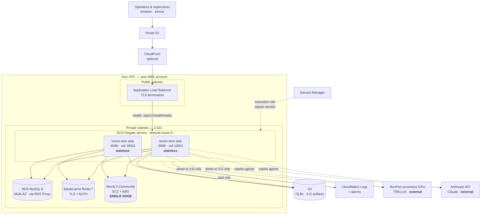
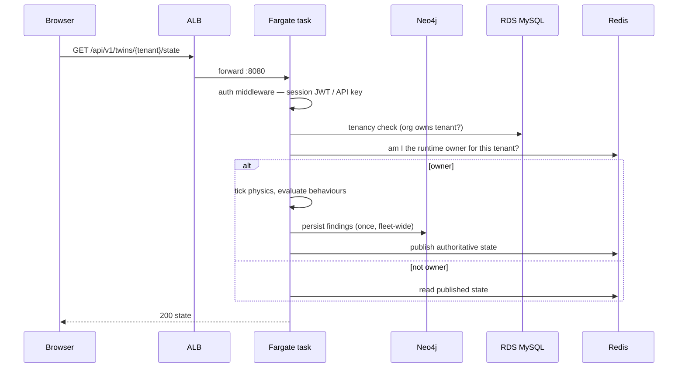
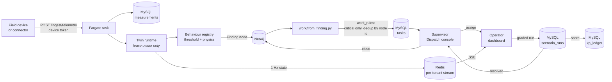

# NextXR Digital Twin — AWS Component Architecture

**Companion to [`AWS_DEPLOYMENT.md`](../AWS_DEPLOYMENT.md)**, which holds the
operational runbook (provisioning commands, the deploy procedure, backup and
recovery). This document is the *architecture* view: what the components are,
why each was chosen, and where the failure modes are.

Everything below reflects the deployment as designed in `AWS_DEPLOYMENT.md` and
the container as built by the repo `Dockerfile`.

---

## 1. Component topology

**Everything except RunPod and the Anthropic API runs inside your VPC and your
AWS account** — Neo4j included. It is an EC2 instance you own rather than a
hosted service, which is a deliberate cost and control choice, and the reason
the single-point-of-failure note below matters.

---

## 2. The four stores, and why there are four

| Store | Holds | Why not one of the others |
|---|---|---|
| **RDS MySQL 8** | records: twin registry, change log, identity/auth, agent bundles, checkpoints, scene cache, 3-D job records, telemetry historian | needs transactions, joins and a migration ledger — a graph is the wrong shape for an audit trail |
| **Neo4j 5** | the twin's graph: entities, relationships, findings | traversal depth is the product ("what does this fault affect, three hops out") — that query in SQL is a recursive CTE nobody can maintain |
| **ElastiCache Redis 7** | the live event bus, one stream per tenant; twin-runtime ownership leases | ephemeral, fan-out, sub-second — durability is not wanted here |
| **S3** | blobs: generated GLBs and 3-D artifacts | binary, large, immutable; putting them in MySQL would bloat backups for no benefit |

Three of the four are managed and redundant.

> ### Neo4j is the only single point of failure in the design
> Community Edition **cannot cluster**. There is no failover — only recovery.
> `AWS_DEPLOYMENT.md` §6.3 covers the nightly `neo4j-admin database dump` (which
> requires the database to be **stopped** on Community, so it is a real
> maintenance window, not a snapshot). Size the recovery plan accordingly, and
> treat "how long can the plant model be unavailable" as a business decision
> rather than an infrastructure one.
>
> The mitigation baked into the app is that **a Neo4j outage is degradation, not
> an outage**: the registry, schema API, auth and the SPA all keep serving.

---

## 3. Request path and readiness

**The ALB health check is `GET /api/v1/health/ready`, and it is allowed to
503.** That is the point: a task that cannot reach MySQL, or that is on the
in-memory bus while `NXR_REQUIRE_REDIS=1`, drops out of rotation without being
killed and rejoins when the dependency recovers.

**Readiness is deliberately narrower than health.** Neo4j being down is *not*
unready — draining every task for a graph outage would be a self-inflicted
outage larger than the fault. The only signal for a sick Neo4j is the `degraded`
status on `GET /api/v1/health`, so that needs its own CloudWatch alarm.

---

## 4. Why multi-task is safe — and the three flags that keep it safe

Relational state used to be five SQLite files on an EFS mount, which pinned the
service at one task (SQLite over NFS is single-writer). Moving records to RDS
and blobs to S3 lifted that. Desired count 2+ across two AZs with rolling
deploys is now correct.

The residual risk is that **each shared store silently degrades to something
task-local when unconfigured** — correct at one task, wrong at two, and never an
error. Each therefore has a required-flag that converts the mistake into a
failed boot:

| Unset | Silent failure at 2+ tasks | Guard |
|---|---|---|
| `NXR_DATABASE_URL` | per-task SQLite; each task serves different twins | `NXR_REQUIRE_DB=1` |
| `NXR_S3_BUCKET` | a model generated on task A 404s on task B | `NXR_REQUIRE_S3=1` |
| `NXR_REDIS_URL` | each task sees only its own events; live updates stop for some users | `NXR_REQUIRE_REDIS=1` |

**Set all three on any multi-task service.** A task that crash-loops with a
one-line reason in CloudWatch is a far better outcome than a fleet serving half
the twins and half the models.

### Twin-runtime ownership

The machine-twin simulation is a *stateful integrator* — wear accumulates, an
injected fault persists — so it cannot run in every task. Each tenant's
simulation is held by whichever task owns a short **Redis lease**:

- the owner ticks physics, evaluates behaviours, persists findings **once**, and
  publishes authoritative state every second
- non-owners never tick and never persist; they serve the published state and
  forward control actions to the owner via a per-tenant command queue
- if an owner dies, the lease expires after **~8 s** and another task *adopts the
  published state*, continuing rather than restarting the simulation

Ownership is per tenant, so load still spreads and there is no singleton service
to keep alive. `GET /api/v1/health` reports this task's `twin_runtime.owned`
list — **across the fleet each tenant should appear exactly once.** This is the
other reason `NXR_REQUIRE_REDIS=1` matters: without Redis, every task believes
it owns every twin, which is exactly the duplicate-write behaviour above.

---

## 5. Task definition essentials

| | |
|---|---|
| Container port | `8080` → ALB target group |
| User | uid/gid **10001**, baked into the image |
| Execution role | pulls image, injects Secrets Manager values |
| Task role | S3 object read/write on the blob bucket — the app's own identity, distinct from the execution role |
| Volumes | **none required.** Mount EFS only for 3-D scratch survival; the access point must use uid/gid 10001 or the first write to `/data` fails |
| Logging | CloudWatch `awslogs`. `PYTHONUNBUFFERED=1` is set, so the `[auth]`, `[db]`, `[blobs]`, `[bus]` posture lines reach the log |

### Configuration split

**Plain environment:** `PORT`, `NEO4J_URI` (private IP or internal DNS of the
EC2 instance; `bolt+s://` if TLS is terminated there), `NEO4J_USER`,
`NXR_S3_BUCKET`, `NXR_S3_PREFIX`, and the three `NXR_REQUIRE_*` flags.

**Secrets Manager:** `NEO4J_PASSWORD`, `NXR_DATABASE_URL` (contains the RDS
credential), `NXR_REDIS_URL` (contains the AUTH token), `NXR_JWT_SECRET`,
`ANTHROPIC_API_KEY`.

> `NXR_JWT_SECRET` must be **stable and shared across tasks**. The app refuses to
> boot with an ephemeral signing key while auth is enforced — otherwise each task
> would sign tokens the others reject, and users would be logged out at random by
> load balancing.

---

## 6. Data flow — telemetry to dispatched work

This is the product's spine, and it crosses every component.

The loop closes: a supervisor accepting a fix writes the Finding back to
resolved in the graph. `work_rules` decides which findings become tasks — the
default is **critical only**, on purpose, because a platform that raises a task
for every warning teaches operators to ignore tasks.

---

## 7. Security posture

| Layer | Control |
|---|---|
| Edge | TLS at ALB; CloudFront optional in front |
| Network | RDS, ElastiCache and Neo4j in **private subnets**, no public IPs; security groups admit only the ECS task SG |
| Identity | session JWTs (rotating refresh tokens) or scoped API keys; auth **required by default** — an unset key variable no longer means "open" |
| Authorisation | two axes: `role` for data, `persona` for dispatch; tenancy checked per request |
| Secrets | Secrets Manager, injected by the execution role; never in the task definition's plain environment |
| Data at rest | RDS and EBS encryption; S3 SSE |
| Data in transit | TLS to ALB; Redis TLS + AUTH; optional `bolt+s://` to Neo4j inside the VPC |
| Audit | `identity.audit_log` for account actions; hash-chained `changelog.events` for twin mutations |
| Container | non-root uid/gid 10001 |

**Cross-tenant isolation** is enforced at two levels: `org_tenants` binds a
tenant to an organisation and every relational read filters on `org_id`; every
Neo4j node is uniquely keyed on `(tenantId, id)` with a per-label constraint.
`tests/test_tenant_isolation.py` covers the boundary.

---

## 8. External dependencies

| Service | Used for | If it is down |
|---|---|---|
| **RunPod** (serverless GPU, TRELLIS) | photo → 3-D reconstruction | that feature fails; nothing else is affected |
| **Anthropic API** (Claude) | the 16 copilot agents | **every agent returns its deterministic stub** and `/copilot/health` reports `"mode": "stub"` — pages still render, with no silent substitution |

Both are optional to the core twin. Neither is in the request path for
monitoring, dispatch or telemetry.

> **Cost note.** Copilot spend is metered by `copilot/spend.py` and exposed on
> `/api/v1/copilot/health`. The per-tenant budget cap is **disabled unless
> `NXR_COPILOT_BUDGET_USD` is set**, so on a publicly reachable deployment agent
> spend is unbounded. Set it before exposing the API.

---

## 9. Deployment pipeline

**There is none, deliberately.** `AWS_DEPLOYMENT.md` §0 records that the
CodePipeline/CodeBuild path was removed; deployment is the manual procedure in
§12 (build image → push to ECR → update task definition → update service).

Schema changes are applied by a **one-off ECS task** running
`python -m db.migrations` *before* the service rolls — `NXR_AUTO_MIGRATE` stays
`0` in production, because several tasks starting at once would race to apply
the same migration. Locally it is `1`, since dev is a single process.

Source of record is GitHub (`Tejesh3305/Goalcert_Digital-Twin`), with AWS
CodeCommit retained as a mirror. Nothing deploys from CodeCommit.

---

## 10. Known constraints

1. **Neo4j Community cannot cluster** — one instance, recovery not failover, and the backup needs the database stopped.
2. **Change-log writes serialise per tenant.** `append()` takes a MySQL `GET_LOCK()` advisory lock for its transaction so a tenant's hash chain cannot fork. Tenants never block each other, but one tenant's write throughput is bounded by that lock — the correct trade for a tamper-evident ledger.
3. **The three silent fallbacks** (§4) are only safe because of the required-flags. Deploying multi-task without them is the highest-consequence misconfiguration available.
4. **Copilot budget is off by default** (§8).
5. **A read-only supervisor cannot dispatch.** The auth middleware refuses every `POST` from a read-only principal before the persona check runs, so `role='read'` + `persona='supervisor'` — an account shape the data model explicitly allows — cannot assign work. Seeded supervisors use `write`, so this is latent rather than active.
