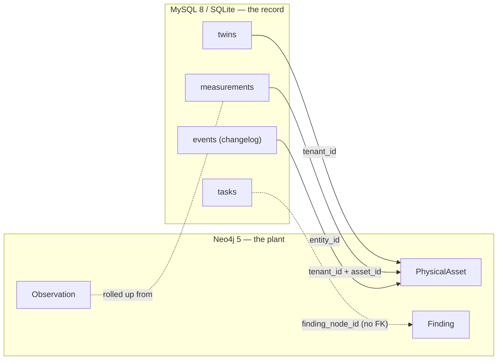
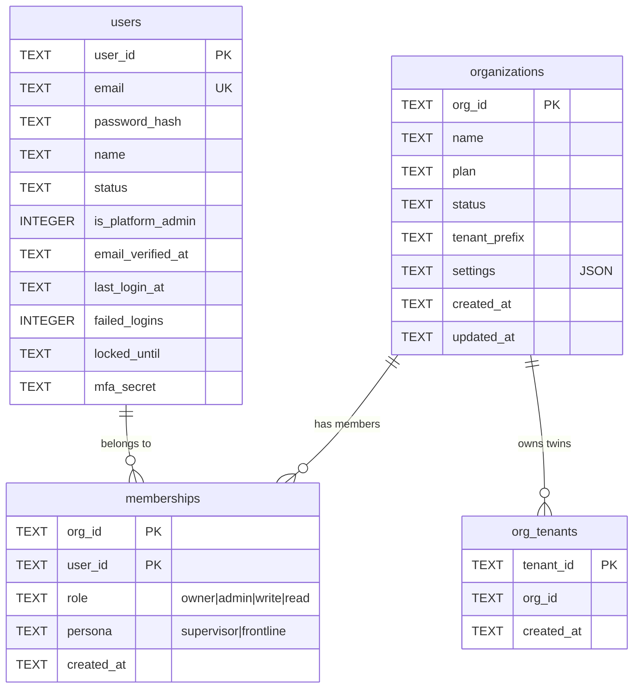
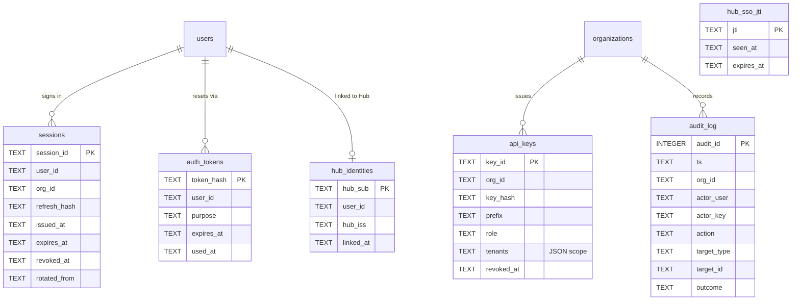
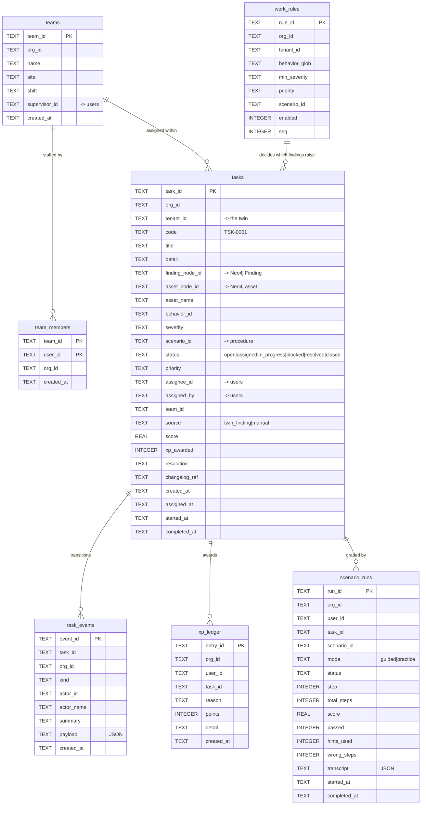
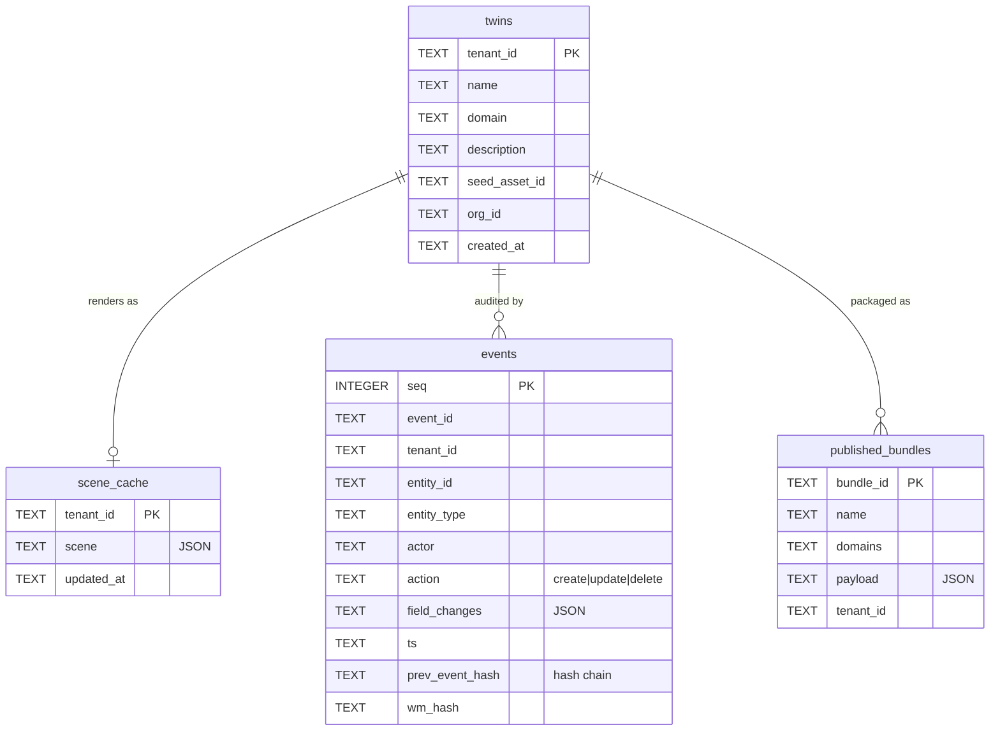
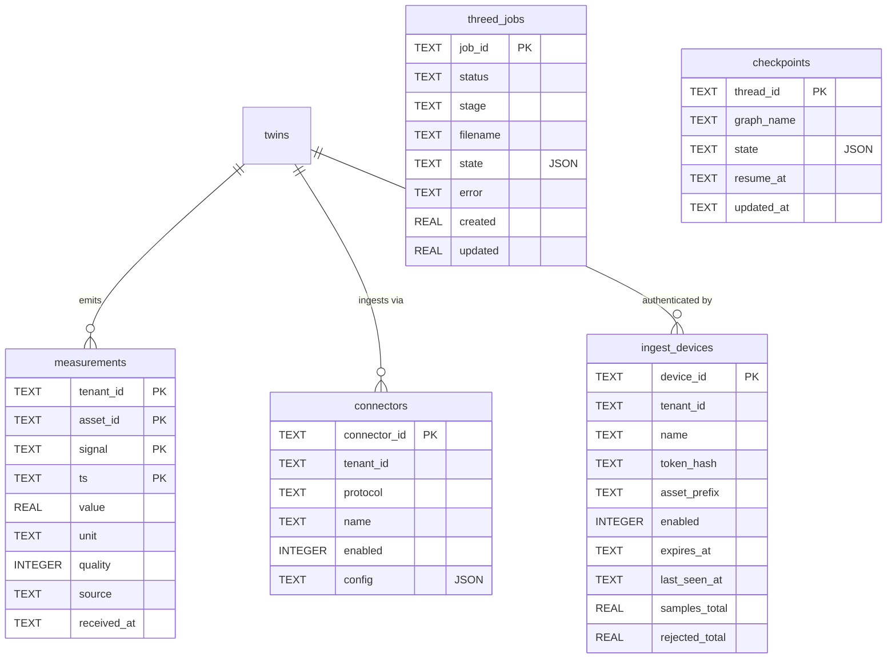
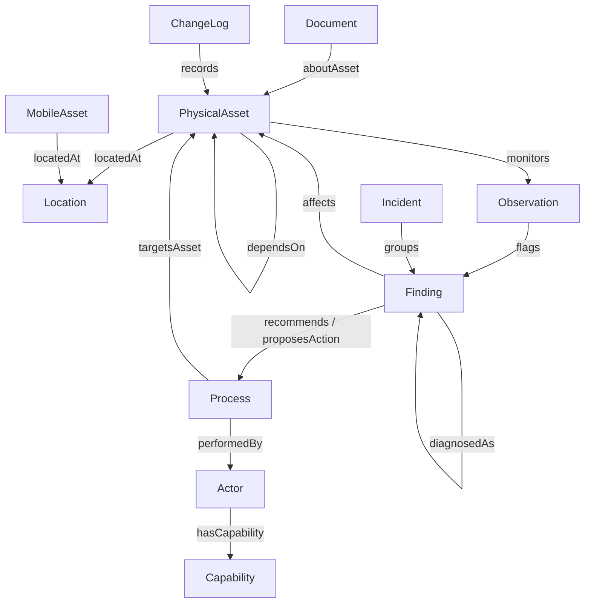

# NextXR Digital Twin — Data Model

**Generated from the live schema on 2026-09-07.** Every table, column and row
count below was introspected from the running databases rather than transcribed
from a design document, so this reflects what the system actually stores.

Source of truth for the relational schema is
[`nextxr-ontology/db/schema.py`](../nextxr-ontology/db/schema.py); the graph
schema is provisioned by
[`nextxr-ontology/graph/schema.py`](../nextxr-ontology/graph/schema.py).

---

## 1. The polyglot split

This is the first thing to understand, because it is the design decision every
other one follows from. The platform uses **two databases with two different
jobs**, and they are deliberately not joined at the database layer.

| | Holds | Answers |
|---|---|---|
| **Neo4j** (graph) | entities, relationships, findings | *What is the plant, and what is wrong with it* |
| **MySQL / SQLite** (relational) | identity, dispatch, telemetry history, registry | *Who did what about it, and when* |

The seam between them is the pair `(tenant_id, node_id)`. A `tasks` row points
at a Finding by `finding_node_id` and **copies nothing** from it. Dropping every
relational row would lose the dispatch history and not one byte of twin state;
dropping the graph would lose the plant model and leave the audit trail intact.

> **There are no declared foreign keys anywhere in the relational schema.** This
> was verified, not assumed: `PRAGMA foreign_key_list` returns zero rows for
> every table. Referential integrity is enforced in the service layer
> (`work/service.py`, `identity/service.py`) and supported by 13 indexes on the
> work store alone. The relationships drawn below are therefore **logical**, and
> a diagram that showed them as enforced constraints would be lying about the
> guarantees. This is a deliberate trade — the schema targets both SQLite and
> MySQL through one DDL path — but it does mean orphan rows are possible if a
> write bypasses the service layer.

---

## 2. Identity and tenancy

The account model, shown as two diagrams rather than one: the four tables that
define *who exists* answer different questions from the six that record *how
they proved it*, and a single ten-entity diagram is wide enough that its column
names stop being readable in print.

**2a — Accounts and tenancy.** `organizations` owns everything, and `org_tenants`
is what binds a twin to an organisation — the join every authorisation check
walks.

**2b — Credentials, sessions and audit.** Everything here is a *hash or a record
of use*: no plaintext credential is stored in any of these tables.

`hub_sso_jti` stands alone by design — it is a replay guard, recording each
Goalcert Hub SSO ticket id once so the same ticket cannot be presented twice.

### The two role vocabularies

`memberships` carries **two orthogonal columns**, and collapsing them is the
change this design exists to prevent:

| column | vocabulary | answers | governs |
|---|---|---|---|
| `role` | owner / admin / write / read | what data may you touch | tenancy, via `server/tenancy.py` |
| `persona` | supervisor / frontline | what job do you do | dispatch, via `work/authority.py` |

A supervisor who may only read the twin is an ordinary account — they dispatch
people, they do not edit the plant model. One column cannot express both.

> **Known gap.** Over HTTP the two are not fully independent: `server/auth.py`
> refuses every `POST` from a read-only principal before any persona check runs,
> so a `role='read'` supervisor cannot assign. `work/seed.py` issues `write`, so
> shipped accounts work. Flagged here because the schema promises a separation
> the middleware does not yet honour.

---

## 3. Work and dispatch

The fault-to-fix loop. This is the half of the product that records **what people
did** about what the twin detected.

### Three design points the shape encodes

**`task_events` is append-only.** A `status` column remembers only the present.
"Who assigned this, when, and what happened next" is the question asked after an
incident, so every transition appends a row in the same call that changes the
status.

**`xp_ledger` is a ledger, not a counter.** A total that can only be incremented
cannot be explained, audited or corrected. The total is a `SUM`, and
`(user_id, task_id, reason)` is unique so a double award is refused by the
database rather than by a check-then-write race in Python.

**Scoring is server-side.** `scenario_runs.score` is written by
`scenario/guided.py` from the answer key, which never leaves the server. If the
page held the answers, the score would be a claim the browser made about itself.

---

## 4. Twin registry, content and telemetry

**4a — Registry and published content.** What a twin *is*, and the artefacts
generated from it.

**4b — Ingest, telemetry and jobs.** How readings arrive, who is allowed to send
them, and the asynchronous work they trigger.

`threed_jobs` and `checkpoints` carry no `tenant_id`: a reconstruction job and an
agent checkpoint are keyed by their own opaque id and reached only by the caller
that created them.

**`measurements` has a four-column primary key** — `(tenant_id, asset_id,
signal, ts)`. That is what makes ingest idempotent: replaying a batch overwrites
rather than duplicating.

**`events` is hash-chained.** Each row carries `prev_event_hash`, so the change
log is tamper-evident rather than merely append-only.

---

## 5. The graph model (Neo4j 5)

Eleven node categories, every one uniquely keyed by `(tenantId, id)` — that
composite is the multi-tenancy boundary, enforced by a uniqueness constraint per
label. Verified live: **11 constraints, 25 indexes**.

**Node categories:** `Actor`, `Capability`, `ChangeLog`, `Document`, `Finding`,
`Incident`, `Location`, `MobileAsset`, `Observation`, `PhysicalAsset`, `Process`.

The relationship vocabulary is not ad-hoc — it comes from the ontology
(`platform/nxr-properties.ttl`), which declares 25+ `owl:ObjectProperty` terms
including `locatedAt`, `containedIn`, `hasPart`, `partOf`, `hasPort`,
`connectsTo`, `dependsOn`, `feeds`, `monitors`, `observedAs`, `flags`,
`diagnosedAs`, `indicatesFailureMode`, `recommends`, `proposesAction`,
`assignedTo`, `performedBy`, `targetsAsset`. Domain packs (`packs/hvac`,
`packs/edm`, …) extend the class hierarchy but reuse this predicate set.

**The Finding is the hinge of the whole product.** A behaviour evaluates
telemetry, writes a `Finding` into the graph, and `work/from_finding.py` turns
qualifying Findings into `tasks` rows. That is the only place the two databases
meet, and it is one-directional: closing a task writes the Finding back to
resolved, but no graph node ever holds a `task_id`.

---

## 6. Physical deployment of the stores

| Logical store | Local dev | Production |
|---|---|---|
| identity, work, twins, changelog, bundles, checkpoints, scenes, threed, devices, connectors, historian | one SQLite file each, under `nextxr-ontology/data/` | **one RDS MySQL 8 database**, all stores sharing a transaction domain |
| graph | Neo4j in Docker (`neo4j_data` volume) | **Neo4j 5 Community on EC2**, EBS-backed |
| blobs (GLBs, 3-D artifacts) | local filesystem | **S3** |
| event bus | Redis in Docker, in-memory fallback | **ElastiCache Redis 7** |

`db/core.py` picks the backend from `NXR_DATABASE_URL`: set it and every store
is MySQL; unset and each store is its own SQLite file. The DDL is written
SQLite-flavoured and translated for MySQL, which is why `datetime('now')` and
`INSERT OR IGNORE` do not appear anywhere in `store.py` files.

Migrations are ledgered in `schema_migrations` and applied by
`python -m db.migrations`. Current head: **0006_work_graph**.

---

## 7. Live row counts (2026-09-07)

Useful as a sanity baseline; these are development volumes, not production.

| Table | Rows |
|---|---|
| historian.measurements | 34,347 |
| changelog.events | 13,961 |
| identity.sessions | 100 |
| identity.audit_log | 190 |
| checkpoints.checkpoints | 57 |
| twins.twins | 16 |
| threed.threed_jobs | 11 |
| work.task_events | 12 |
| work.scenario_runs | 8 |
| identity.org_tenants | 8 |
| scenes.scene_cache | 5 |
| work.tasks | 3 |
| identity.users / memberships | 3 / 3 |
| identity.organizations | 2 |
| work.xp_ledger | 2 |
| work.teams / team_members / work_rules | 1 / 1 / 1 |
| devices.ingest_devices | 1 |
| bundles.published_bundles | 3 |
| connectors.connectors / identity.api_keys | 0 / 0 |

> **The graph is currently near-empty — 3 nodes, 0 relationships**, against 16
> registered twins. The relational side persisted across restarts; the Neo4j
> volume did not retain content. Constraints and indexes are provisioned, so this
> is a data-loading gap rather than a schema one, but it means no Finding
> currently exists and the three `tasks` rows are seed fixtures with empty
> `tenant_id` and `finding_node_id`. Rebuild via
> `twins/seed.py::seed_demo_twins()`.
